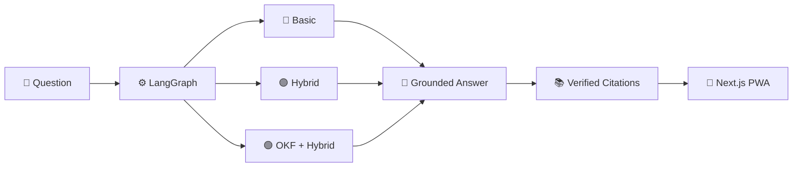
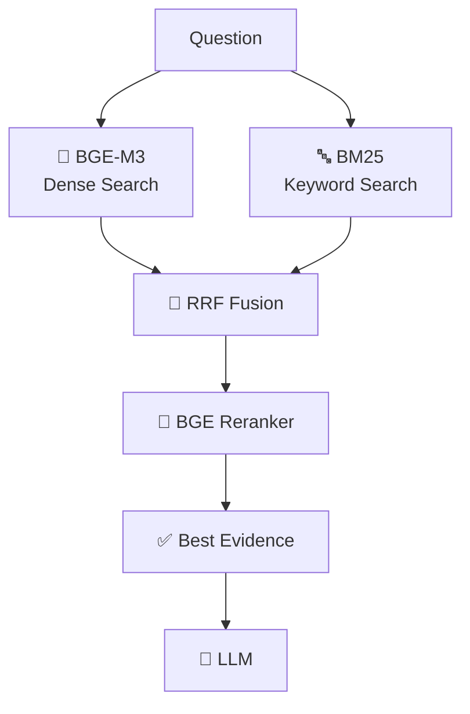
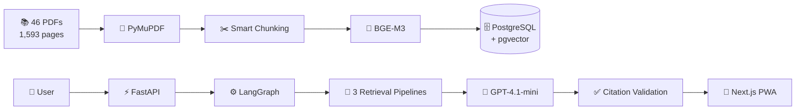
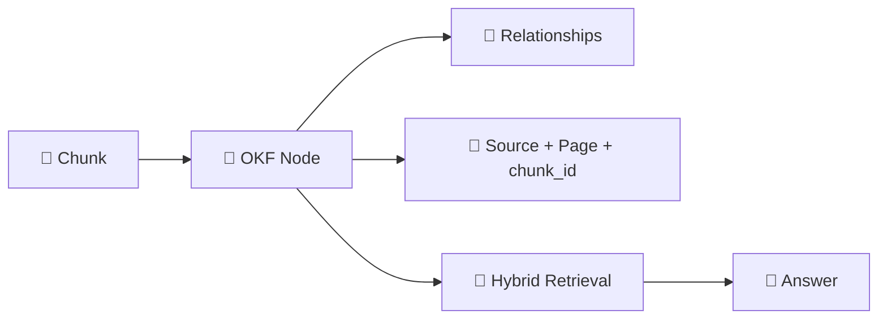
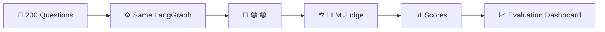
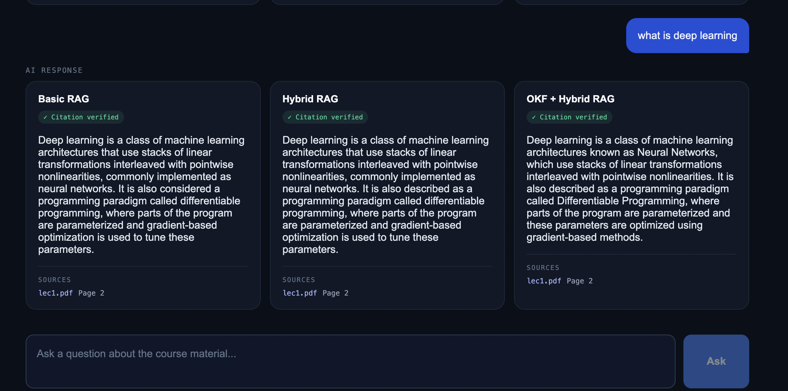
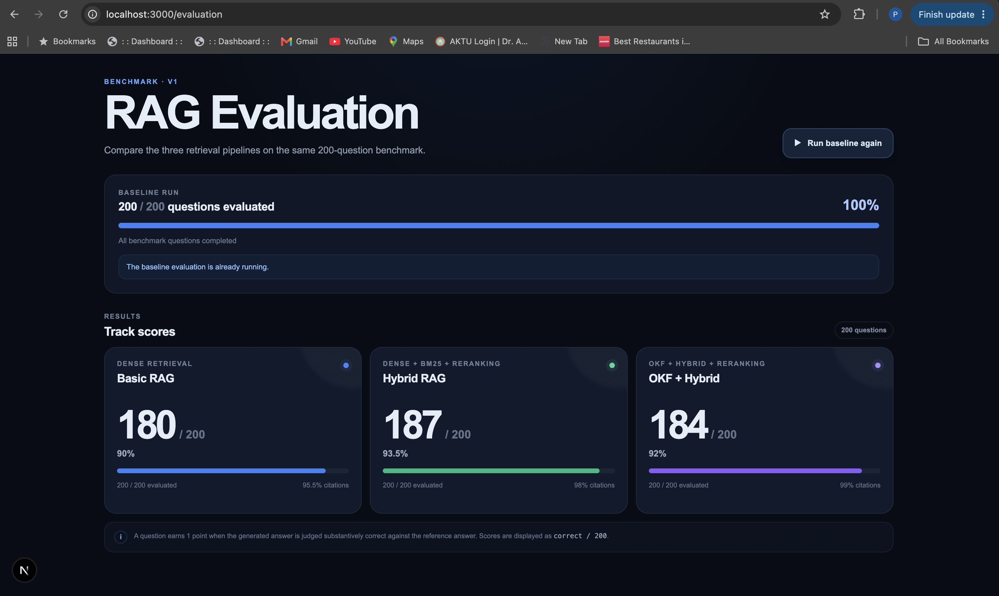
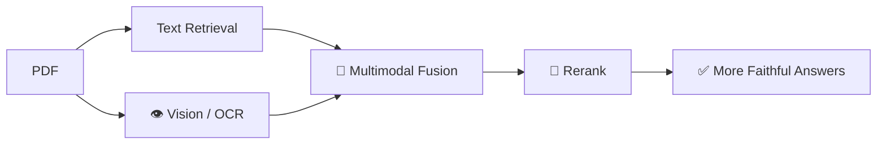

# 🚀 Course AI Assistant

<p align="center">
  <b>Three RAG architectures. One corpus. 200 questions. Measured results.</b>
</p>

<p align="center">
  
  
  
  
  
</p>


## 🎯 What is it?

A **production-style course AI assistant** built on **46 MIT Machine Learning + Deep Learning PDFs**.

Instead of using one RAG pipeline, it runs three approaches in parallel:

**🔵 Basic RAG  ·  🟣 Hybrid RAG  ·  🟢 OKF + Hybrid RAG**



---

## 🏆 V1 Results

**200-question benchmark**

| Pipeline | Accuracy | Citation Validity |
|---|---:|---:|
| 🔵 Basic RAG | 90.0% | 95.5% |
| 🟣 Hybrid RAG | **93.5% 🏆** | 98.0% |
| 🟢 OKF + Hybrid | 92.0% | **99.0% 🏆** |

**Hybrid RAG → best answer accuracy**  
**OKF + Hybrid → best citation validity**

> Citation validity checks provenance; semantic citation faithfulness is planned for V2.

---

## 🔍 Why Hybrid RAG?



Dense search handles meaning. BM25 catches exact technical terms. RRF combines them. The reranker chooses the strongest evidence.

A difficult batch-size query initially missed the target in dense retrieval; **Hybrid + Reranking moved the correct chunk to #1.**

---

## 🏗️ System



**1,593 pages → 1,680 chunks → 1,653 usable OKF nodes**

---

## 🛠️ Tech Stack

**Frontend**  
Next.js · React · TypeScript · PWA · SSE

**Backend**  
Python · FastAPI · Pydantic · LangChain · LangGraph

**Retrieval**  
BGE-M3 · BM25 · RRF · BGE-reranker-v2-m3

**Data**  
PostgreSQL · pgvector · Alembic · JSONL · PyMuPDF

**LLM / Evaluation**  
GPT-4.1-mini · Structured outputs · 200-question benchmark

---

## 🧩 OKF Layer

OKF converts chunks into structured knowledge while preserving the original source:



This keeps structured retrieval **traceable back to the original PDF chunk**.

---

## ⚙️ Problems → Engineering Fixes

| Challenge | Solution |
|---|---|
| Visual-heavy PDFs | Visual/OCR candidate detection |
| Dense retrieval misses exact wording | BM25 + RRF |
| Similar chunks rank too high | Cross-encoder reranking |
| OKF loses provenance | Preserve original `chunk_id` |
| 200-question runs are expensive | Incremental + resumable evaluation |
| Frontend hit wrong API | Dedicated FastAPI `API_BASE` |
| LangGraph edge/import bugs | Explicit DAG + clean module ownership |
| Latency was misleading | Separate workflow vs stage timing |

---

## 🧪 Evaluation Flow



The benchmark uses the **same application graph**, so evaluation tests the actual RAG pipeline rather than a separate implementation.

---

## 📸 Screenshots

Replace these with your own images:






---

## 🚧 V2



**OCR · ColPali · multimodal fusion · citation faithfulness · LangSmith · stage-level observability · cloud deployment**

---

## ▶️ Run

```bash
# Backend
uv sync
uv run uvicorn app.main:app --reload --port 8000

# Frontend
cd frontend
npm install
npm run dev
```

Evaluation:

```bash
uv run python -m app.evaluation.runner   --dataset data/evaluation/ml_dl_evaluation_200_clean.jsonl   --run-id baseline
```

---

<p align="center">
  <b>Ingest → Retrieve → Rerank → Generate → Validate → Evaluate</b><br>
  Built to measure what actually makes RAG better. 🚀
</p>
